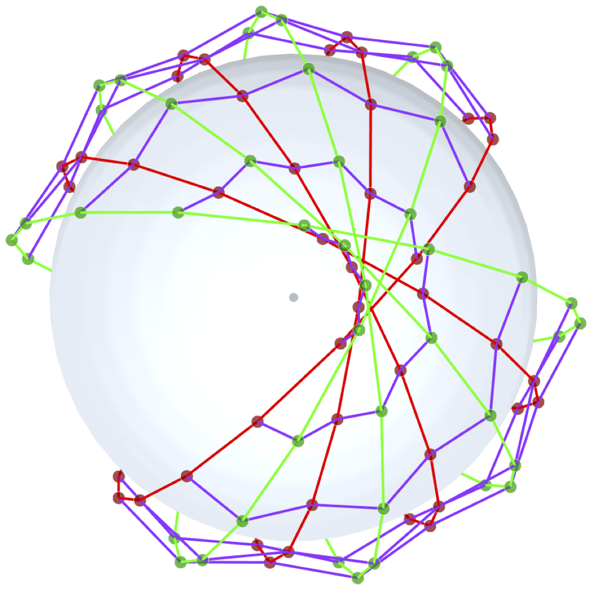
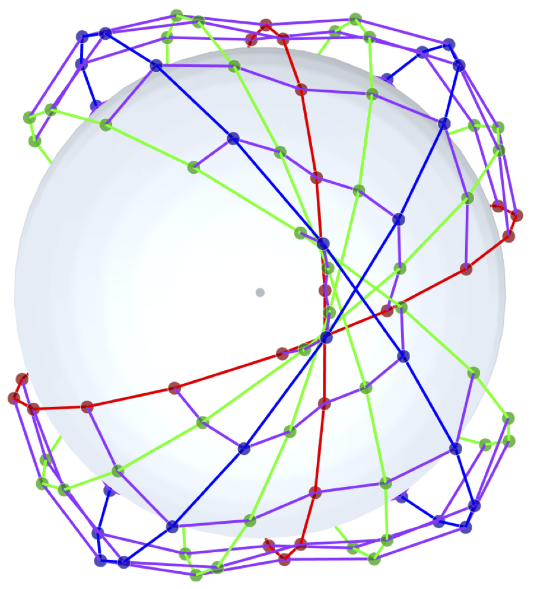
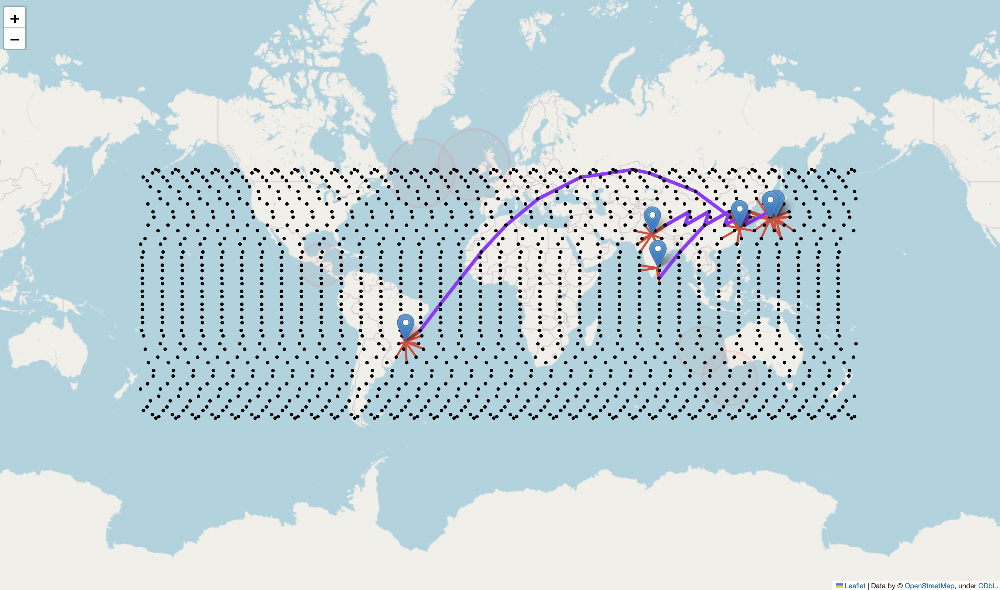
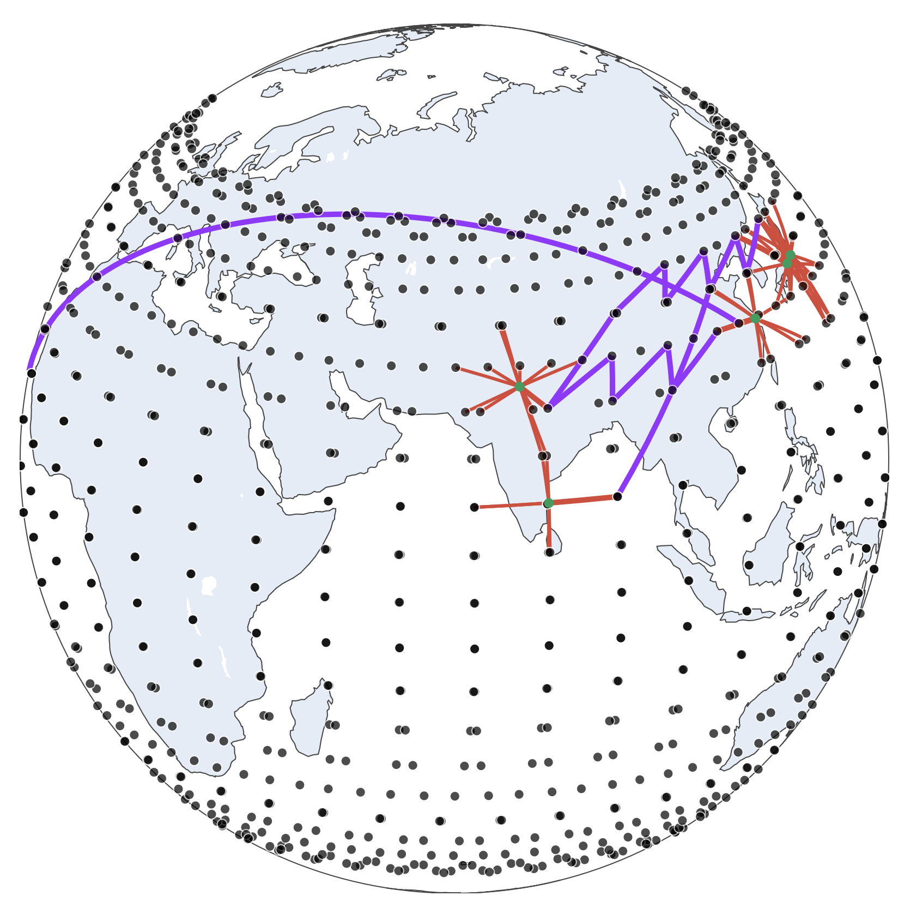
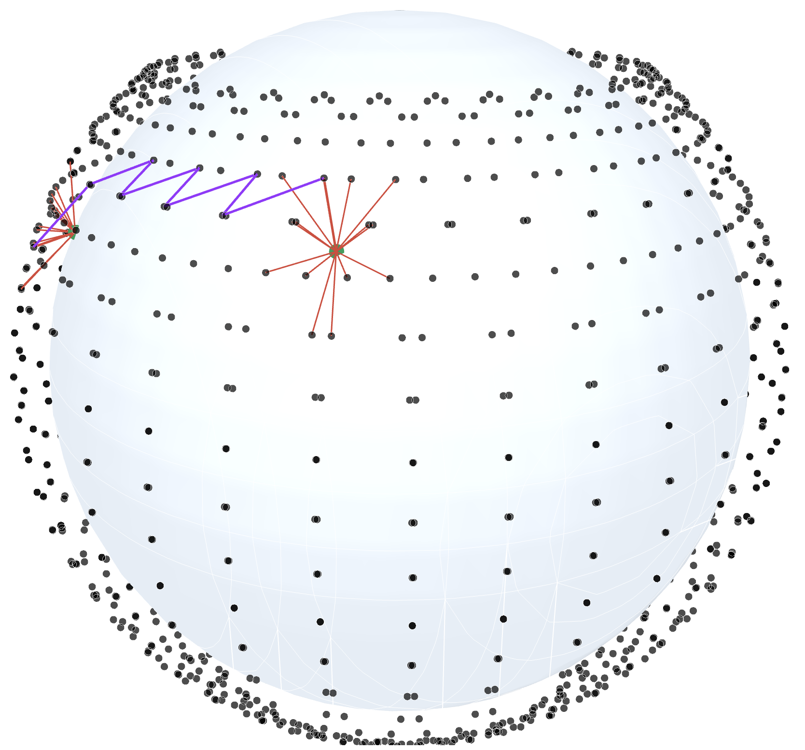

# LEOCraft - A Flow Level LEO Network Simulator

A modular and extensible LEO network simulation platform to explore traffic flow, throughput, stretch/latency, and coverage. LEOCraft operates as a flow level to evaluate a given LEO constellation quickly.


# Table of Contents
- [Getting Started](#Getting-started)
    - [Setup the Simulation Environment](#setup-the-simulation-environment)
    - [Get the Academic License for Gurobi Optimizer](#get-the-academic-license-for-gurobi-optimizer)
    - [Test the Simulation Environment](#test-the-simulation-environment)
    - [Unit Tests](#unit-tests)
    - [Simulate with LEOCraft](#simulate-with-leocraft)
        - [Create LEO Constellation](#create-leo-constellation)
        - [Measure Throughput](#measure-throughput)
        - [Measure Stretch/Latency](#measure-stretchlatency)
        - [Measure Coverage](#measure-coverage)
    - [Visualize with LEOCraft](#visualize-with-leocraft)
        - [Visualize in 2D](#visualize-in-2d)
        - [Visualize in 3D](#visualize-in-3d)
    - [Examples](#examples)
        - [LEO Constellation Visulization Examples](#leo-constellation-visulization-examples)
        - [LEO Constellation Simulation Examples](#leo-constellation-simulation-examples)
- [Extend LEOCraft](#extend-leocraft)
    - [Explore the API Docs](#explore-the-api-docs)
    - [Understand Traffic Modeling](#understand-traffic-modeling)
- [License](#license)
- [Cite This Work](#cite-this-work)
- [Artifact Evaluation](#artifact-evaluation)
- [Credits](#credits)

# Getting Started

## Setup the Simulation Environment

Clone the LEOCraft repository.

```bash
git clone https://github.com/suvambasak/LEOCraft.git
```

Change the directory.

```bash
cd LEOCraft
```

Create a conda environment from [environment.yml](/tools/environment.yml) or [environment_macOS.yml](/tools/environment_macOS.yml).

```bash
conda env create -f tools/environment.yml
```
or
```bash
conda env create -f tools/environment_macOS.yml
```

Activate `leocraft` environment.

```bash
conda activate leocraft
```


## Get the Academic License for Gurobi Optimizer

Since `LEOCraft` is a flow-level simulator, it uses [Gurobi Optimizer](https://www.gurobi.com/) to solve the linear program of throughput maximization. To set Gurobi Optimizer:

- Extract the license tools [licensetools12.0.1_linux64.tar.gz](/tools/licensetools12.0.1_linux64.tar.gz) or download the [license tools](https://support.gurobi.com/hc/en-us/articles/360059842732-How-do-I-set-up-a-license-without-installing-the-full-Gurobi-package) based on your platform to the binary `grbgetkey`.

- [Sign up](https://portal.gurobi.com/iam/login/) and generate free [Named-User Academic](https://portal.gurobi.com/iam/licenses/request) license.

- To save the license on your system, execute the following.

```bash
./grbgetkey <LICENSE_KEY>
```

Enter and store the `gurobi.lic` file in the home directory.

```bash
info  : grbgetkey version 12.0.1, build v12.0.1rc0
info  : Platform is linux64 (linux) - "Linux Mint 22.1"
info  : Contacting Gurobi license server...
info  : License file for license ID XXXXXXX was successfully retrieved
info  : License expires at the end of the day on XXXX-XX-XX 
info  : Saving license file...

In which directory would you like to store the Gurobi license file?
[hit Enter to store it in /home/suvam]:
```


## Test the Simulation Environment

Export the `LEOCraft` project path in the shell, which will allow seamless execution of scripts.


```bash
export PYTHONPATH=$(pwd)
```

Or, for instance, if the repository is cloned at `/mnt/Storage/Projects/LEOCraft`


```bash
export PYTHONPATH="/mnt/Storage/Projects/LEOCraft"
```

To validate the simulation environment setup, execute [example_starlink.py](/examples/example_starlink.py), which simulates the Starlink multi-shell LEO constellation.

```bash
python examples/example_starlink.py
```

The `LEOCraft` setup is successful if you see something like this.

```bash
[LEOConstellation] Building ground stations...
[LEOConstellation] Building shells...
[LEOConstellation] Building ground to satellite links...                
[LEOConstellation] GSLs generated in: 0.08m                             
[LEOConstellation] Adding satellites into network graph...
[LEOConstellation] Adding ISLs into network graph...
[LEOConstellation] Routes generated in: 2.2m                            

[Throughput] Building throughput...
[Throughput] Computing throughput...                                    
 LP formation...Set parameter Username
Academic license - for non-commercial use only - expires XXXX-XX-XX
[Throughput] Optimized in: 0.11m                                        
[Throughput] Throughput:    6144.55 Gbps
[Throughput] Total accommodated flow:   30.562 %
[Throughput] NS path selection: 5.929 %
[Throughput] EW path selection: 3.848 %
[Throughput] NESW path selection:   5.325 %
[Throughput] HG path selection: 2.601 %
[Throughput] LG path selection: 7.466 %

[Coverage] Building coverage...
[Coverage] Computing coverage...
[Coverage] Out of coverage GS:  0
[Coverage] GS coverage metric:  148.79394673481124

[Stretch] Building stretch...
[Stretch] Computing stretch...                                          
[Stretch] NS stretch:   1.357
[Stretch] NS hop count: 7.0
[Stretch] EW stretch:   1.504
[Stretch] EW hop count: 8.0
[Stretch] NESW stretch: 1.253
[Stretch] NESW hop count:   6.0
[Stretch] LG stretch:   1.434
[Stretch] LG hop count: 3.5
[Stretch] HG stretch:   1.181
[Stretch] HG hop count: 11.0
Total simulation time: 2.44m
```

## Unit Tests

To run the unit tests, follow the instructions in [tests](/tests/README.md).

## Simulate with LEOCraft

Here is the quick overview simulating an LEO constellation network of Starlink.

### Create LEO Constellation

First, import the LEOCraft modules.

```python
from LEOCraft.attenuation.fspl import FSPL
from LEOCraft.constellations.LEO_constellation import LEOConstellation
from LEOCraft.dataset import GroundStationAtCities
from LEOCraft.satellite_topology.plus_grid_shell import PlusGridShell
from LEOCraft.user_terminals.ground_station import GroundStation
```

Create an instance of the atmospherics path loss model.

```python
loss_model = FSPL(
    28.5*1000000000,    # Frequency in Hz
    98.4,               # Tx power dBm
    0.5*1000000000,     # Bandwidth Hz
    13.6                # G/T ratio
)
loss_model.set_Tx_antenna_gain(gain_dB=34.5)
```

To create a LEO constellation of Starlink, create an object of LEO constellation, add ground stations, and then add the first shell of Starlink of +Grid topology.

```python
leo_con = LEOConstellation('Starlink')
leo_con.add_ground_stations(
 GroundStation(
 GroundStationAtCities.TOP_100
 )
)

leo_con.add_shells(
 PlusGridShell(
        id=0,
        orbits=72,
        sat_per_orbit=22,
        altitude_m=550000.0,
        inclination_degree=53.0,
        angle_of_elevation_degree=25.0,
        phase_offset=50.0
 )
)

leo_con.set_time(second=3)  # Time passed after epoch
leo_con.set_loss_model(loss_model)
leo_con.build()
leo_con.create_network_graph()

leo_con.generate_routes()
```

You will see this on the execution.

```bash
[LEOConstellation] Building ground stations...
[LEOConstellation] Building shells...
[LEOConstellation] Building ground to satellite links...                
[LEOConstellation] GSLs generated in: 0.11m                             
[LEOConstellation] Adding satellites into network graph...
[LEOConstellation] Adding ISLs into network graph...
[LEOConstellation] Routes generated in: 2.83m 
```

### Measure throughput

To measure the throughput of the above Starlink constellation, import the following modules.

```python
from LEOCraft.dataset import InternetTrafficAcrossCities
from LEOCraft.performance.basic.throughput import Throughput
```

Create the instance of throughput, then add the instance of Starlink constellation and traffic matrics across the ground stations to compute the throughput.

```python
th = Throughput(
 leo_con,
 InternetTrafficAcrossCities.ONLY_POP_100
)
th.build()
th.compute()
```

The output will be as follows.

```bash
[Throughput] Building throughput...
[Throughput] Computing throughput...                                    
 LP formation...Set parameter Username
Set parameter LicenseID to value XXXXXXX
Academic license - for non-commercial use only - expires 20XX-XX-XX
[Throughput] Optimized in: 0.02m                                        
[Throughput] Throughput:        2820.032 Gbps
[Throughput] Total accommodated flow:   15.209 %
[Throughput] NS path selection: 1.77 %
[Throughput] EW path selection: 1.455 %
[Throughput] NESW path selection:       1.916 %
[Throughput] HG path selection: 0.999 %
[Throughput] LG path selection: 6.945 %
```

### Measure Stretch/Latency

To measure stretch, import the following module. 

```python
from LEOCraft.performance.basic.stretch import Stretch
```

Create an instance of stretch and add the instance of Starlink constellation to compute stretch.


```python
sth = Stretch(leo_con)
sth.build()
sth.compute()
```

The output will be as follows.

```bash
[Stretch] Building stretch...
[Stretch] Computing stretch...                                          
[Stretch] NS stretch:   1.868
[Stretch] NS hop count: 8.0
[Stretch] EW stretch:   1.668
[Stretch] EW hop count: 8.0
[Stretch] NESW stretch: 1.285
[Stretch] NESW hop count:       6.0
[Stretch] LG stretch:   1.479
[Stretch] LG hop count: 4.0
[Stretch] HG stretch:   1.263
[Stretch] HG hop count: 12.0
```

### Measure Coverage

To measure the coverage of the constellation, import the following module. 

```python
from LEOCraft.performance.basic.stretch import Stretch
```

Create an instance of coverage and add the instance of Starlink constellation to compute coverage. 

```python
cov = Coverage(leo_con)
cov.build()
cov.compute()
```

The output will be as follows.

```bash
[Coverage] Building coverage...
[Coverage] Computing coverage...
[Coverage] Out of coverage GS:  0
[Coverage] GS coverage metric:  111.9799753395037
```


## Visualize with LEOCraft

The LEOCraft provides excellent 2D and 3D interactive visualization capabilities to intuitively understand the LEO network topology and the transition of topology with LEO dynamics.

<p align="center">

&nbsp;&nbsp;&nbsp;&nbsp;

</p>


### Visualize in 2D

To visualize Starlink constellation in 2D, use the `SatView2D` module. Add the components (satellites, ground stations, routes, satellite coverage, etc.) for rendering, as shown below.

```python
from LEOCraft.visuals.sat_view_2D import SatView2D

view = SatView2D(leo_con, default_zoom=2.0)

view.add_all_satellites()
view.add_coverages('S0-0', 'S0-1', 'S0-40', 'S0-31', 'S0-30')
view.add_routes('G-0_G-1', 'G-1_G-2', 'G-2_G-3', 'G-30_G-33', k=1)

view.build()

view.export_html('docs/html/Starlink_2D.html')
```

The output will be as follows.

```bash
[SatView2D] Building view 2D...  
[SatView2D] Exporting HTML...  
```

The interactive 2D visualization [Starlink_2D.html](/docs/visuals/Starlink_2D.html).

<p align="center">

</p>

### Visualize in 3D

To visualize the Starlink constellation in 3D, use the `SatView3D` module. Add the add the components (satellites, ground stations, routes, satellite coverage, etc) for rendering as shown in the following.


```python
from LEOCraft.visuals.sat_view_3D import SatView3D

view = SatView3D(leo_con)

view.add_all_satellites()
view.add_routes('G-0_G-1', 'G-1_G-2', 'G-2_G-3', 'G-30_G-33', k=1)

view.build()

view.export_html('docs/html/Starlink_3D.html')
```

The output will be as follows.

```bash
[SatView3D] Building raw view 3D...  
[SatView3D] Exporting HTML...  
```


The interactive 2D visualization [Starlink_3D.html](/docs/visuals/Starlink_3D.html).


To visualize the Starlink constellation in 3D but without maps and satellites at elevation, use the `SatRawView3D` module. Add the components (satellites, ground stations, routes, satellite coverage, etc.) for rendering, as shown below.

```python
from LEOCraft.visuals.sat_raw_view_3D import SatRawView3D

view = SatRawView3D(
 leo_con,

    lat=16.80528,
    long=96.15611,
    elevation_m=550000
)


view.add_all_satellites()
view.add_routes('G-0_G-1', k=1)

view.build()

view.export_html('docs/html/Starlink_RAW_3D.html')
```

The output will be as follows.


```bash
[SatRawView3D] Building raw view 3D...  
[SatRawView3D] Exporting HTML... 
```


The interactive 2D visualization [Starlink_RAW_3D.html](/docs/visuals/Starlink_RAW_3D.html).


<p align="center">

&nbsp;&nbsp;&nbsp;&nbsp;

</p>


## Examples

### LEO Constellation Visulization Examples

Following are some examples of interactive LEO network visualisation. A few videos of LEO dynamics are also available at [LEOCraft Playlist](https://youtube.com/playlist?list=PLNedKW1trAyWUTnCWAtYSwk7kenVV_90k&si=lTPzQwMUiFQJ-bYS).

- LEO consetalltion design
    - [Starlink multi shell design](/docs/visuals/starlink_shells.html)
    - [Kuiper multi shell design](/docs/visuals/kuiper_shells.html)
    - [Telesat multi shell design](/docs/visuals/telesat_shells.html)

- Ground station locations
    - [At 100 most populous city across the world](/docs/visuals/GS_locations_100.html)
    - [At 1000 most populous city across the world](/docs/visuals/GS_locations_1000.html)
    - [At all country capitals](/docs/visuals/GS_locations_CAPITALS.html)

- Starlink coverage change with altitude
    - [At altitude 300 km](/docs/visuals/starlink_coverage_h300.html)
    - [At altitude 600 km](/docs/visuals/starlink_coverage_h600.html)

- Starlink inclination change
    - [At inclination 5 degree](/docs/visuals/starlink_i5.html)
    - [At inclination 40 degree](/docs/visuals/starlink_i40.html)
    - [At inclination 90 degree](/docs/visuals/starlink_i90.html)

- Starlink high geodesic distance path diversity
    - [When o=144, n=11, p=50](/docs/visuals/starlink_high_geodesic_distance_route_o144_n11_p50.html)
    - [When o=144, n=11, p=0](/docs/visuals/starlink_high_geodesic_distance_route_o144_n11_p0.html)
    - [When o=48, n=33, p=50](/docs/visuals/starlink_high_geodesic_distance_route_o48_n33_p50.html)

- Proposed inter shell ISL connectivity
    - [Between two shells](/docs/visuals/inter_shell_ISLs_2_shells.html)
    - [Between three shells](/docs/visuals/inter_shell_ISLs_3_shells.html)

- ISLs usage visualization
    - [With 100 most populous city across the world](/docs/visuals/ISL_usage_100.html)
    - [With all country capitals](/docs/visuals/ISL_usage_CAP.html)

- ISL topological structures tweak
    - [orbits=72, sat_per_orbit=22, phase_offset=50.0](/docs/visuals/o72_n22_p50.html)
    - [orbits=22, sat_per_orbit=72, phase_offset=50.0](/docs/visuals/o22_n72_p50.html)
    - [orbits=44, sat_per_orbit=36, phase_offset=50.0](/docs/visuals/o44_n36_p50.html)
    - [orbits=44, sat_per_orbit=36, phase_offset=0.0](/docs/visuals/o44_n36_p0.html)

- Route change with inclination and elevation angle
    - [Inclination 90 degree](/docs/visuals/i90.html)
    - [Inclination 50 degree](/docs/visuals/i50.html)
    - [Inclination 30 degree](/docs/visuals/i30.html)
    - [Elevation angle 10 degree](/docs/visuals/e10.html)
    - [Elevation angle 30 degree](/docs/visuals/e30.html)
    - [Elevation angle 50 degree](/docs/visuals/e50.html)

- Number of hops in route reduces with higher altitude
    - [Altitude 550 km](/docs/visuals/route_h550.html)
    - [Altitude 1000 km](/docs/visuals/route_h1000.html)

- Route categories based on orientation
    - [North East to South West](/docs/visuals/NESW.html)
    - [East to West](/docs/visuals/EW.html)
    - [North to South](/docs/visuals/NS.html)
    - [High Geodesic Distance](/docs/visuals/HG.html)

- Others
    - [Satellite ground track](/docs/visuals/satellite_ground_track.html)
    - [2D view of route, GS, GSLs satellites, satellite coverage](/docs/visuals/Starlink_2D.html)
    - [3D view of route, GS, GSLs satellites](/docs/visuals/Starlink_3D.html)
    - [3D RAW view of route, GS, GSLs satellites](/docs/visuals/Starlink_RAW_3D.html)
    - [Coverage cone change with value of elevation angle](/docs/visuals/coverage_cone_with_e.html)


### LEO Constellation Simulation Examples

A handful of examples of Python scripts for programming the LEO network simulation and generating interactive visuals are available in [examples](/examples/index.md).

- [Simulate Starlink multi shell constellation with ground stations](/examples/example_starlink.py)
- [Simulate a batch of LEO constellation with ground stations](/examples/example_LEO_constellation_bulk_simulation.py)
- [Simulate Starlink multi shell constellation with flights](/examples/example_LEO_constellation_for_aviation.py)
- [Simulate a batch of LEO constellation with flights](/examples/example_LEO_constellation_bulk_simulation.py)
- [Simulate LEO constellation with inter-shell ISLs](/examples/example_intershell_ISLs.py)
- [Visualize LEO constellation in 2D](/examples/example_visuals2D.py)
- [Visualize LEO constellation in RAW 3D](/examples/example_visuals_raw_3D.py)
- [Visualize LEO constellation in 3D](/examples/example_visuals3D.py)
- [Render evolution LEO network frame by frame](/examples/example_visuals3D_frames.py)
- [Archive of proposed shell designs](/examples/shell_code_archive.py)


# Extend LEOCraft

LEOCraft is designed with **modularity and extensibility** at its core. Whether you're exploring custom satellite constellations, novel inter-satellite routing schemes, new traffic models, or advanced performance metrics, LEOCraft provides the scaffolding to implement and test your ideas quickly and rigorously.

## Where to Start

### Explore the API Docs

Dive into the [API documentation](https://suvambasak.github.io/LEOCraft/docs/html/LEOCraft/index.html) to understand the architecture and core components of LEOCraft—from constellation modeling and link computation to routing and performance evaluation.

### Understand Traffic Modeling

Check out the traffic dataset [source](/dataset/src/README.md) to learn how Internet demand between cities is modeled and how you can plug in your own demand matrices or traffic sources.


# License
This work is licensed under the [MIT License](/LICENSE).


# Cite This Work

## Plain text

```

```

## BibTeX

```bibtex

```


# Artifact Evaluation
For executing the experiments and regenerating the figures in the paper, straightforward steps are given in [ARTIFACT EVALUATION](/docs/ARTIFACT_EVALUATION.md).

# Credits

Contributors whose support and expertise have been invaluable in the development of **LEOCraft**:

- [**Amitangshu Pal**](https://www.cse.iitk.ac.in/users/amitangshu/)
- [**Debopam Bhattacherjee**](https://bdebopam.github.io)
